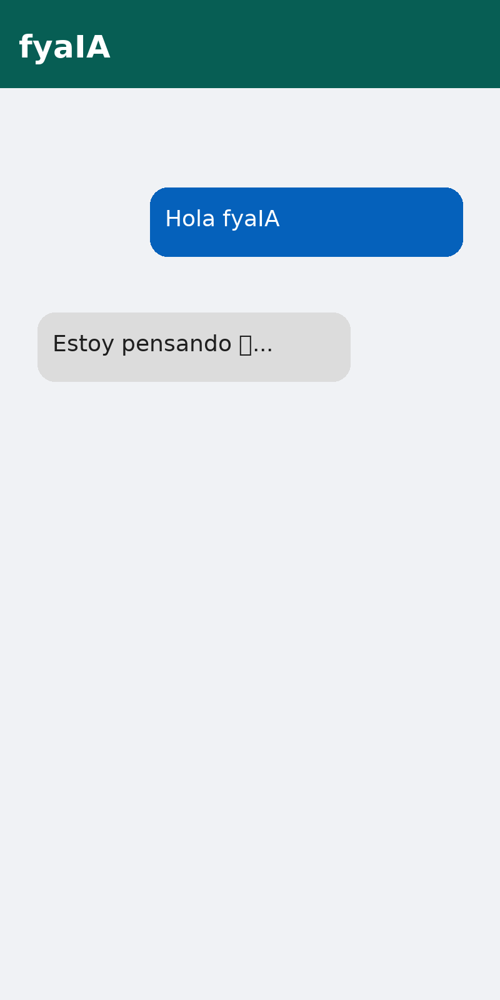

# 🤖 fyaIA  

  

**fyaIA** es un asistente virtual inspirado en *Fe y Alegría 68*.  
Chat moderno tipo **WhatsApp/Telegram** con burbujas y respuestas automáticas simuladas.  

---

## 🚀 Demo
Cada vez que escribes un mensaje 💬, fyaIA responde automáticamente con frases variadas.

Ejemplo de conversación:  
👤 Usuario: Hola fyaIA  
🤖 fyaIA: Estoy pensando 🤔...  



---

## 📦 Instalación

1. Clona este repositorio:
   ```bash
   git clone https://github.com/tuusuario/fyaIA.git
   cd fyaIA
   ```

2. Instala dependencias:
   ```bash
   npm install
   ```

3. Corre en local:
   ```bash
   npm run dev
   ```
   Abre [http://localhost:3000](http://localhost:3000).

---

## ☁️ Despliegue en Vercel
1. Sube este proyecto a GitHub.  
2. En Vercel → **New Project** → importa tu repo → **Deploy**.  

---

## ✨ Tecnologías
- Next.js
- React
- Tailwind CSS
- Framer Motion

---

## ❤️ Autor
Proyecto para **Fe y Alegría 68**.
